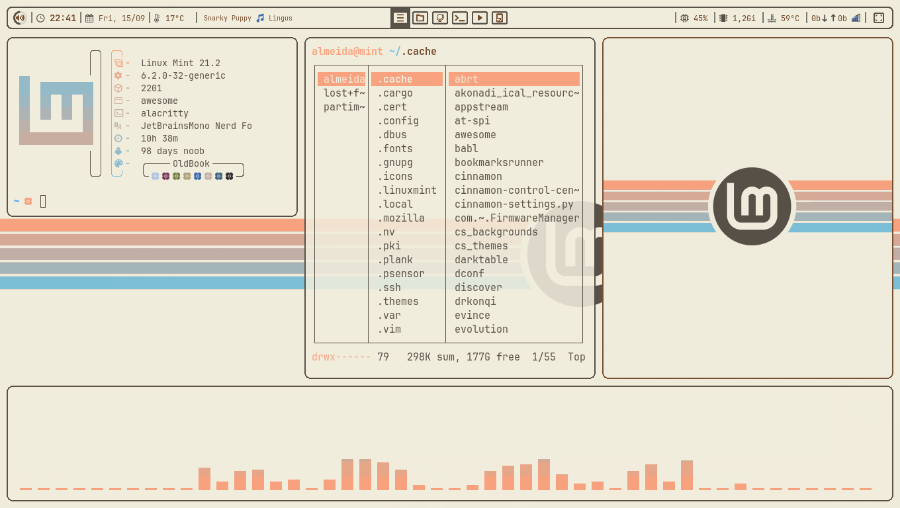

<h1 align="center"> DotFiles,</h1>
<h3 align="center"><i>almeida's</i> <b>.config</b> <i>backup & a noob's work in progress.</i> </h3>

_______

## A keyboard centered, with good mouse support, experience.

This dotfiles are meant to be used with both ```OpenSuse Tumbleweed``` and ```Linux Mint``` with ```awesomewm``` as desktop environment, but they work with any other distro with some tinkering.

Avaliable in two colorschemes: BlackLotus (dark theme) and OldBook (light theme).

- BlackLotus:


- OldBook

<i>not final</i>

_______

## INSTALLATION

_______


### Program list (essential):

- [AwesomeWM](https://awesomewm.org/) as the window manager
- [JetBrainsMono Nerd Font](https://www.nerdfonts.com/font-downloads) as the **font**
- [Alacritty](https://github.com/alacritty/alacritty) for terminal-emulator
- [Rofi](https://github.com/DaveDavenport/rofi) for the app launcher
- [Nemo](https://github.com/linuxmint/nemo) for file-manager
- [picom](https://github.com/yshui/picom) for the compositor (blur and animations)
- [feh](https://github.com/derf/feh) as background setter
- [i3lock-color](https://github.com/Raymo111/i3lock-color) as the lockscreen application
- [gnome-polkit](https://developer-old.gnome.org/platform-overview/unstable/tech-polkit.html.en) recommend using the gnome-polkit as it integrates nicely for elevating programs that need root access
- [lxappearance](https://sourceforge.net/projects/lxde/files/LXAppearance/) to set up the gtk and icon theme
- [xfce4-screenshooter](https://docs.xfce.org/apps/screenshooter/start) as screenshot app
- [network-manager-applet](https://gitlab.gnome.org/GNOME/network-manager-applet) nm-applet is a Network Manager Tray display from GNOME.
- [xfce4-power-manager](https://docs.xfce.org/xfce/xfce4-power-manager/start) XFCE4's power manager is excellent and a great way of dealing with sleep, monitor timeout, and other power management features.

  #### BlackLotus Theme:
- [Numix-BLACK-ice](https://www.gnome-look.org/p/1335655) as GTK theme 
- [BLACK-Pomegranate-Numix](https://www.gnome-look.org/p/1335817) as icon theme
- [Sunity-cursors](https://www.gnome-look.org/p/1703043) as cursor theme

  #### OldBook Theme:
- [Breeze-Solarized-Light](https://www.gnome-look.org/p/1241238) as GTK theme 
- [Adwaita](https://gnome.pages.gitlab.gnome.org/libadwaita/) as icon theme
- [Sunity-cursors](https://www.gnome-look.org/p/1703043) as cursor theme

_______

### Dependencies (most are optional, see 'Program list':

#### - OpenSUSE Tumbleweed:
```
sudo zypper install awesome awesome-extra picom polkit polkit-gnome arandr feh lxappearance opi timeshift alacritty rofi neovim ranger xclip nemo xfce4-power-manager file-roller firefox xfce4-screenshooter neofetch cava gimp udisks2 gparted vlc xed transmission evince git xbacklight flatpak
```
```
opi i3lock-color
```
```
flatpak remote-add --if-not-exists flathub https://dl.flathub.org/repo/flathub.flatpakrepo
flatpak install spotify vscodium citra
```

#### - Linux Mint:
```
sudo apt install awesome awesome-extra picom policykit-1-gnome arandr feh lxappearance timeshift alacritty rofi neovim ranger xclip nemo xfce4-power-manager file-roller firefox xfce4-screenshooter neofetch cava gimp udisks2 gparted vlc xed transmission evince git xbacklight flatpak
```
```
sudo add-apt-repository ppa:codejamninja/jam-os
sudo apt-get update
sudo apt-get install i3lock-color
```
```
flatpak remote-add --if-not-exists flathub https://dl.flathub.org/repo/flathub.flatpakrepo
flatpak install spotify vscodium citra
```
_______


### Clone the files

```
git clone https://github.com/PoisonIsBestType/.config
```


Then place them into their respective folders:
- `~/.themes`, `~/.icons` and `~/.fonts` for `theme-files`
- `~` for `bash`
- `/lib/python3.11/site-packages/ranger/colorschemes` or `/lib/python3/dist-packages/ranger/colorschemes`for `ranger/*.py` 

_______

### Set the themes

Start `lxappearance` to activate the **icon** theme and **GTK** theme.

Place the content from ```gtk-3.0``` in both `~/.config/gtk-3.0/` and `/root/.config/gtk-3.0/` for the change to also show up in applications run as root. Also good to edit `~/.icons/default/index.theme` and plance the `theme-files` in their respective `/usr/share/` places.


_______

### Awesome Keybinds:
TODO

_______

This is a noob's repository, don't expect much!

### Have a good one!

_______
