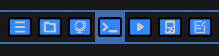
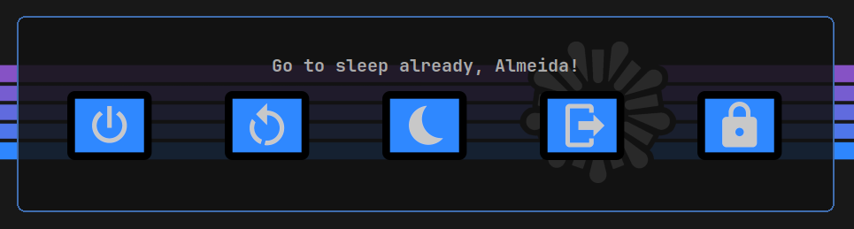
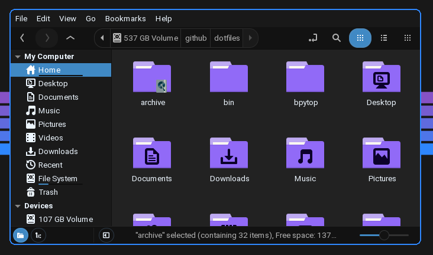

<h1 align="center">📁 DotFiles 📁</h1>
<p align="center"><i>Almeida's</i> <code>.config</code> <i>backup & a noob's work in progress.</i></p>

_______

<p align="center"> Original <code>awesomewm</code> desing by <a href="https://github.com/material-shell/material-awesome">PapyElGringo</a>, this version is based on <a href="https://github.com/ChrisTitusTech/titus-awesome">ChrisTitusTech</a>'s fork. </p>

_______
_______
<h3 align="center">📝 INDEX 📝</h3>

<details>
<summary><b>
Click here
</b></summary>

- <a href="https://github.com/PoisonIsBestType/dotfiles#-galery-">Galery</a>

- <a href="https://github.com/PoisonIsBestType/dotfiles#-manual-setup-">Manual setup</a>

- <a href="https://github.com/PoisonIsBestType/dotfiles#-program-list">Program list</a>

- <a href="https://github.com/PoisonIsBestType/dotfiles#-clone-the-files">Clone the files</a>

- <a href="https://github.com/PoisonIsBestType/dotfiles#-auto-setup-">Auto setup</a>

- <a href="https://github.com/PoisonIsBestType/dotfiles#-post-install">Post install</a>

- <a href="https://github.com/PoisonIsBestType/dotfiles#-set-the-theme-">Set the theme</a>

- <a href="https://github.com/PoisonIsBestType/dotfiles#%EF%B8%8F-keybinds-%EF%B8%8F">Keybinds</a>

- <a href="https://github.com/PoisonIsBestType/dotfiles#-documentation-">Documentation</a>


</details>

_______
_______

### A keyboard centered experience, with good mouse support. 

This fork is a hybrid keyboard/mouse driven setup. The whole system can be controled by using the keyboard alone, but the [keybinds](https://github.com/PoisonIsBestType/dotfiles#%EF%B8%8F-keybinds-%EF%B8%8F) focus on left hand usage  by concentrating the controls in the `W/A/S/D` area and using the `Super` key as main modkey, freeing the user's right hand to use the mouse as needed.


<i>These dotfiles are meant to be used with both</i> `OpenSuse Tumbleweed` <i>and</i> `Linux Mint` <i>using</i> `awesomewm` <i>as desktop environment, but they could work on any other distro with some tinkering.</i>

Avaliable in both dark and light colorschemes:

<p align="center">🌸 <a href="https://github.com/PoisonIsBestType/BlackLotus">BlackLotus</a>: </p>


<p align="center">📜 <a href="https://github.com/PoisonIsBestType/OldBook">OldBook</a>: </p>


_______
_______

<h2 align="center">📷 GALERY 📷</h2>

 <details>
<summary><b>
Click here 
</b></summary>
  
  
<p align="center">Top Panel: </p>

  
- Left side <i>(volume, time/calendar/date, wheather, spotify)</i>


- Center <i>(tag-list)</i>



- Right side <i>(cpu/ram usage, temperature, network, tile-layout)</i>


_______

<p align="center">Modules / Widgets: </p>

  
- Exit-screen <i>(P/R/S/O/L keys and mouse activation)</i>



- Calendar <i>(click time/date to show/hide and scroll to change month)</i>


- Lock-screen <i>(i3lock)</i>


_______

<p align="center">GTK / Icons: </p>

  
- Nemo



_______

<p align="center">Applications: </p>
  
- Alacritty <i>(Vim showing terminal colors)</i>


- BpyTOP


- Ranger


- Rofi <i>(based on [Adamekka](https://github.com/Adamekka/rofi)'s config)</i>


_______

<p align="center">Screenshots: </p>
  
- BlackLotus


- OldBook


</details>

_______
_______

<h2 align="center">🏗 MANUAL SETUP 🏗</h2>


### 💻 Program list:
<i>(essential for out of the box usage)</i>


<p align="center">⚙️ System </p>

| Name | Function | Description |
|-------------------|-----------------------|-------------|
| [awesomewm](https://awesomewm.org/) | Window manager | Main environment |
| [JetBrainsMono Nerd Font](https://www.nerdfonts.com/font-downloads) | Font | Applied system-wide | 
| [alacritty](https://github.com/alacritty/alacritty) | Terminal  emulator | Fast and simple |
| [rofi](https://github.com/DaveDavenport/rofi) | App launcher | Functional and very customizable |
| [nemo](https://github.com/linuxmint/nemo) | File-manager | One of the best GUI file managers |
| [picom](https://github.com/yshui/picom) | Compositor | Can be replaced with **compton** editing `apps.lua` |
| [feh](https://github.com/derf/feh) | Background setter | Simple but able to randomize |
| [i3lock-color](https://github.com/Raymo111/i3lock-color) | Lockscreen application | Light and customizable |
| [gnome-polkit](https://developer-old.gnome.org/platform-overview/unstable/tech-polkit.html.en) | Policy handling | Integrates nicely for elevating programs that need root access |
| [lxappearance](https://sourceforge.net/projects/lxde/files/LXAppearance/) | Icon/GTK/Cursor theme setter | Not necessary but helpful GUI option |
| [xfce4-screenshooter](https://docs.xfce.org/apps/screenshooter/start) | Screenshot app | Full-screen/Area/Delay support with GUI helper |
| [network-manager-applet](https://gitlab.gnome.org/GNOME/network-manager-applet) | NM systray display | Integrates nicely with any system |
| [xfce4-power-manager](https://docs.xfce.org/xfce/xfce4-power-manager/start) | Power manager | Excellent for dealing with sleep, monitor timeout, and other power management features |

<p align="center">🌸 BlackLotus theme-files</p>

| Name | Function | Description |
|-------------------|-----------------------|-------------|
| [Numix-BLACK-ice](https://www.gnome-look.org/p/1335655) | GTK theme | Dark grey with light blue accents |
| [BLACK-Pomegranate-Numix](https://www.gnome-look.org/p/1335817) | Icon theme | Purple accent |
| [Sunity-cursors](https://www.gnome-look.org/p/1703043) | Cursor theme | Midway through classic and modern |

<p align="center">📜 OldBook theme-files</p>

| Name | Function | Description |
|-------------------|-----------------------|-------------|
| [Breeze-Solarized-Light](https://www.gnome-look.org/p/1241238) | GTK theme | Beautifully tanned |
| [Adwaita](https://gnome.pages.gitlab.gnome.org/libadwaita/) | Icon theme | A classic |
| [Sunity-cursors](https://www.gnome-look.org/p/1703043) | Cursor theme | Midway through classic and modern |

_______


### 📥 Clone the files

```
git clone --depth=1 --recursive https://github.com/PoisonIsBestType/dotfiles.git
```

Then place the chosen files (<i>BlackLotus or OldBook, Mint or Suse</i>) into their respective folders:
- `~/.themes`, `~/.icons` and `~/.fonts` for `theme-files`
- `~` for `bash` (optional)
- `/lib/python3.11/site-packages/ranger/colorschemes` or `/lib/python3/dist-packages/ranger/colorschemes`for `ranger/*.py`
- `~/.config` for the rest

_______
_______

<h2 align="center">🤖 AUTO SETUP 🤖</h2>

---TODO---

 <details>
<summary><b>
Click here 
</b></summary>

For now, here are some dependencies install commands:

<p align="center"> OpenSUSE Tumbleweed </p>

```
sudo zypper install awesome awesome-extra picom polkit polkit-gnome arandr feh lxappearance opi timeshift alacritty rofi neovim ranger xclip nemo xfce4-power-manager file-roller firefox xfce4-screenshooter neofetch cava gimp udisks2 gparted vlc xed transmission evince git xbacklight flatpak
```
```
opi i3lock-color
```
```
flatpak remote-add --if-not-exists flathub https://dl.flathub.org/repo/flathub.flatpakrepo
flatpak install spotify vscodium citra
```


<p align="center"> Linux Mint </p>

```
sudo apt install awesome awesome-extra picom policykit-1-gnome arandr feh lxappearance timeshift alacritty rofi neovim ranger xclip nemo xfce4-power-manager file-roller firefox xfce4-screenshooter neofetch cava gimp udisks2 gparted vlc xed transmission evince git xbacklight spotify flatpak
```
```
sudo apt install autoconf gcc make pkg-config libpam0g-dev libcairo2-dev libfontconfig1-dev libxcb-composite0-dev libev-dev libx11-xcb-dev libxcb-xkb-dev libxcb-xinerama0-dev libxcb-randr0-dev libxcb-image0-dev libxcb-util-dev libxcb-xrm-dev libxkbcommon-dev libxkbcommon-x11-dev libjpeg-dev
git clone https://github.com/Raymo111/i3lock-color.git
cd i3lock-color
./install-i3lock-color.sh
```
```
flatpak remote-add --if-not-exists flathub https://dl.flathub.org/repo/flathub.flatpakrepo
flatpak install vscodium citra
```

### Clone the files

```
git clone --depth=1 --recursive https://github.com/PoisonIsBestType/dotfiles.git
cd dotfiles
cp -r alacritty ~/.config/
cp -r awesome ~/.config/
cp -r bpytop ~/.config/
cp -r cava ~/.config/
cp -r gtk-3.0 ~/.config/
cp -r neofetch ~/.config/
cp -r ranger ~/.config/
cp -r rofi ~/.config/
cp -r theme-files/fonts/ ~/.fonts
cp -r theme-files/icons/ ~/.icons
cp -r theme-files/themes/ ~/.themes
```
Then:
- Move content outside from `awesome-suse`, `awesome-mint`, `blacklotus`, `oldbook` directorys as chosen.
- Delete the unneeded files.
- Move `ranger/*.py` to `/lib/python3.11/site-packages/ranger/colorschemes` or `/lib/python3/dist-packages/ranger/colorschemes`.

</details>

<i>(soon I will put here an automated way to setup the config for both OldBook and BlackLotus in both OpenSUSE and Mint)</i>
_______
_______

### 🏁 Post install

Edit the lines:

`image_source="/home/almeida/.config/neofetch/*"`
in `~/.config/neofetch/config.conf` 

&

`--image="/home/almeida/.config/awesome/background/*-stripe.png" \`
in `~/.config/awesome/scripts/*-lock.sh` 

Replacing `almeida` for your username to rectify the image paths.

_______
_______

<h2 align="center">🎨 SET THE THEME 🎨</h2>

<i>(by default the config files are set to BlackLotus)</i>

Set the chosen colorscheme by editing:

`~/.config/awesome/theme/default-theme.lua`

`~/.config/bpytop/bpytop.conf` 

`~/.config/ranger/rc.conf`

`~/.config/rofi/menu.rasi`

Start `lxappearance` to activate the **GTK**, **icons** and **cursor** themes.

Place the content from ```gtk-3.0``` in both `~/.config/gtk-3.0/` and `/root/.config/gtk-3.0/` for the change to also show up in applications run as root. Also good idea to edit `~/.icons/default/index.theme` and copy the `theme-files` to their respective `/usr/share/` directories.


_______
_______

<h2 align="center">⌨️ KEYBINDS ⌨️</h2>

| MOD | KEY | Description |
|-------------------|-----------------------|-------------|
| `Super` | `F1` | Show help |
| `Super` | `F4` | Exit screen |
| `Super` | `F5` | Reload awesome |
| `Super` | `Pause` | Lock screen |
| `Super`+`Ctrl` | `Q` | Quit awesome |
| `Super` | `W/A/S/D/Z/X/C` | View tag 1~7 |
| `Super`+`Ctrl` | `W/A/S/D/Z/X/C` | Move focused client to tag 1~7 |
| `Super`+`Shift` | `W/A/S/D/Z/X/C` | Toggle tag 1~7 |
| `Super` | `Q` | Close focused client |
| `Super` | `Enter` | Open tag's default application |
| `Super` | `R` | Application launcher (Rofi) |
| `Alt` | `Space` | Rofi run |
| `Super` | `T` | Terminal |
| `Super` | `G` | File manager |
| `Super` | `B` | Browser |
| `Super` | `H` | Ranger |
| `Super` | `M` | BpyTOP |
| `Super` | `Tab` | Last viewed tag |
| `Super` | `=` | Next tag by index |
| `Super` | `-` | Previous tag by index|
| `Super` | `Up` | Focus client above |
| `Super` | `Down` | Focus client below |
| `Super` | `Left` | Focus client to the left |
| `Super` | `Right` | Focus client to the right |
| `Super`+`Ctrl` | `Up` | Move focused client up |
| `Super`+`Ctrl` | `Down` | Move focused client down |
| `Super`+`Ctrl` | `Left` | Move focused client left|
| `Super`+`Ctrl` | `Right` | Move focused client right |
| `Super` | `Space` | Toggle client floating |
| `Super` | `F` | Toggle client full-screen |
| `Super`+`Shift` | `Space` | Select next layout |


_______
_______

<h2 align="center">📄 DOCUMENTATION 📄</h2>

The documentation live within the source code.

The project is split in functional directories and in each of them there is a readme where you can get additional information about the them.

* [Configuration](./awesome/awesome-suse/configuration) is about all the **settings** available
* [Keys](./awesome/awesome-suse/configuration/keys/) is where all the **keybinds** are
* [Layout](./awesome/awesome-suse/layout) hold the **disposition** of all the widgets
* [Module](./awesome/awesome-suse/module) contain all the **features** available
* [Theme](./awesome/awesome-suse/theme) hold all the **aesthetic** aspects
* [Widget](./awesome/awesome-suse/widget) contain all the **widgets** available

_______
_______

<a href="https://github.com/PoisonIsBestType/dotfiles#-dotfiles-">⬆️ Back to the top</a>

_______


<p align="center">This is a noob's repository, don't expect much!</p>
<p align="center">Have a good one!</p>

_______
